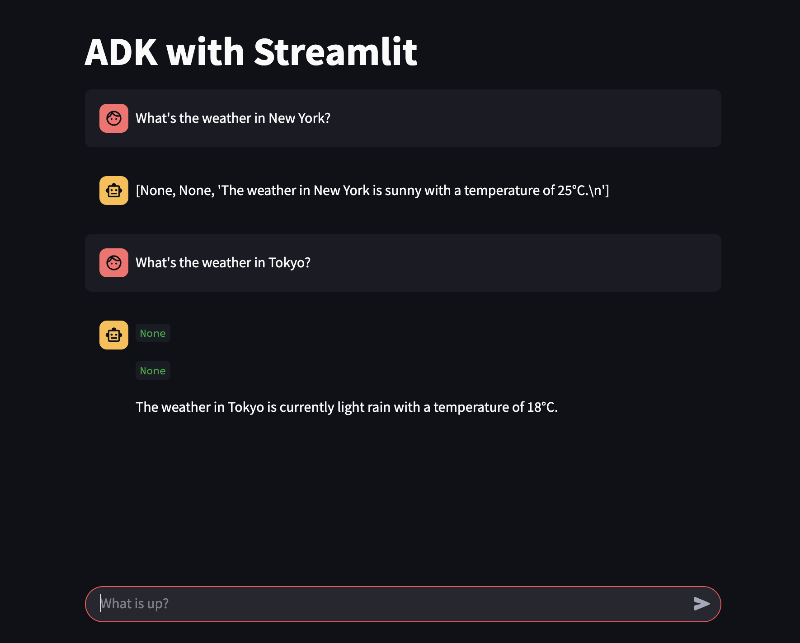

# adk-streamlit

A preconfigured Streamlit frontend for
[Agent Development Kit](https://github.com/google/adk-python).



## Usage

1. Clone this repository

   ```
   git clone https://github.com/koverholt/adk-streamlit.git
   ```

2. Install dependencies

   ```
   pip install -r requirements.txt
   ```

3. Change to the app directory

   ```
   cd adk-streamlit/streamlit-agent
   ```

4. Run the app

   ```
   streamlit run agent.py
   ```

5. Navigate to the app in your browser

   http://localhost:8501


6. Try various prompts!

- > What's the weather in New York?
- > What's the weather in Tokyo?
- > What's the weather in Phoenix?
